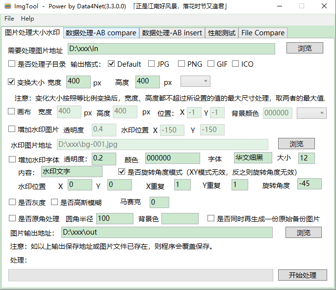

# ImgTool 工具介绍

## 简介：

很多很多年前，曾经为了自营商铺准备的exe，曾经的尝试，曾经的青春，曾经的曾经。

## 如何使用：
下载完成后，运行 ImgTool/ImgTool.exe 即可（纯绿色，无需安装）。

## 附录：

### 更新记录：

##### 1.14（2025.05.19）
* 增加 UI 皮肤模式切换（亮色/暗色）
* 默认启动时 UI 为亮色

##### 1.13（2023.07.14）
* 修改 exe icon（新设计）
* 升级 framework 到 4.8 版本
* 增加新的 UI 皮肤

##### 1.12（2023.04.19）
* 增加变化图片大小选项（近似算法）

##### 1.11.1（2022.07.22）
* 圆角处理增加图片最大安全边距检查

##### 1.11（2022.07.21）
* 圆角处理支持百分比模式

##### 1.10 (2022.02.14)
* 增加图片变化大小的强制拉伸功能。

##### 1.9 (2022.01.12)
* 优化部分处理逻辑，修改部分处理优先级，更符合使用习惯的思考逻辑。

##### 1.8 (2022.01.12)
* 调整部分UI位置

##### 1.7 (2021.12.02)
* 增加圆角处理功能

### 截图：

