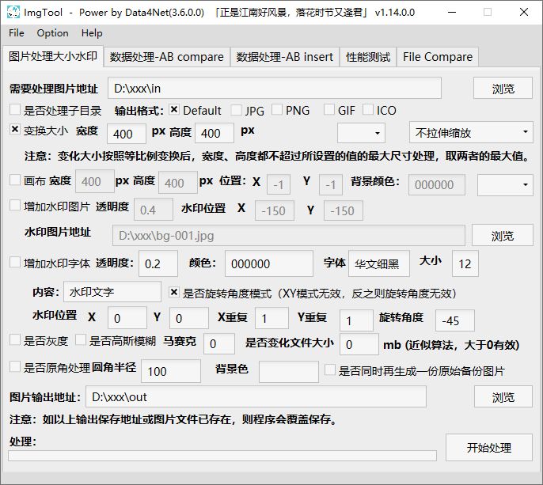

# ImagTool 工具介绍

## 简介：

曾经为了商铺准备的exe，曾经的试玩，曾经的试水，曾经的曾经。

## 如何使用：
下载完成后，运行 ImgTool/ImgTool.exe 即可（纯绿色，无需安装）。

## 附录：

### 更新记录：

##### 1.8 (2021.01.12)
* 调整部分UI位置

##### 1.7 (2021.12.02)
* 增加圆角处理功能

### 截图：

